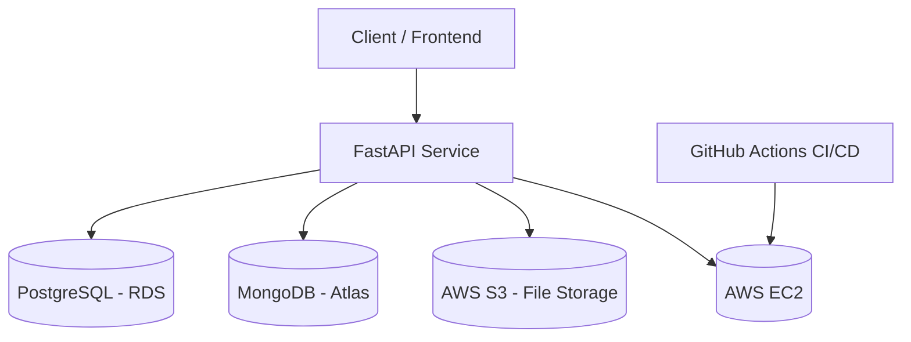

# FastAPI Cloud Microservice

<p >
  
  
  <!--  -->
</p>

<p align="justify">
  This project is a comprehensive CRUD microservice built with FastAPI. It utilizes PostgreSQL for structured data, MongoDB for unstructured data, and is containerized with Docker for easy setup and deployment. It also integrates with AWS S3 for file storage and includes a CI/CD pipeline using GitHub Actions for automated testing and deployment.
</p>

---

## Table of Contents

- [Features](#features)
- [Technologies Used](#technologies-used)
- [Project Structure](#project-structure)
- [Architecture](#architecture)
- [Getting Started](#getting-started)
  - [Prerequisites](#prerequisites)
  - [Installation & Running with Docker](#installation--running-with-docker)
  - [Local Development Setup](#local-development-setup)
  - [Makefile Commands](#makefile-commands)
- [API Endpoints](#api-endpoints)
- [Database Migrations](#database-migrations)
- [Running Tests](#running-tests)
- [Deployment](#deployment)
- [Contributing](#contributing)
<!-- - [License](#license) -->
- [Author](#author)
- [Acknowledgements](#acknowledgements)

---

## Features

- **Modern Python Framework**: Built with **FastAPI** for high performance and automatic interactive documentation.
- **Dual Database Architecture**:
  - **PostgreSQL**: For core relational data like users, products, and orders.
  - **MongoDB**: For unstructured data like OTPs and token blacklists.
- **Authentication & Authorization**: Robust JWT-based authentication with access and refresh tokens, password hashing, and role-based access control (superusers).
- **Containerized Environment**: **Docker** and **Docker Compose** for consistent development, testing, and production environments.
- **Cloud Storage Integration**: Seamlessly integrated with **AWS S3** for file uploads and management.
- **Database Migrations**: Uses **Alembic** for managing PostgreSQL schema migrations.
- **Asynchronous Operations**: Fully asynchronous from the API layer down to the database for non-blocking I/O.
- **Comprehensive Testing**: Unit and integration tests using **Pytest** to ensure code quality and reliability.
- **CI/CD Pipeline**: Automated testing and deployment pipeline configured with **GitHub Actions**.

---

## Technologies Used

- **Backend**: FastAPI, Python 3.13
- **Databases**: PostgreSQL, MongoDB
- **Containerization**: Docker, Docker Compose
- **Cloud Services**: AWS S3, AWS EC2, AWS RDS
- **Authentication**: JWT, Passlib, python-jose
- **ORM/ODM**: SQLAlchemy (asyncio), Motor
- **Migrations**: Alembic
- **Testing**: Pytest, Pytest-asyncio, HTTPX
- **CI/CD**: GitHub Actions

---

## Project Structure

```
fastapi-cloud-microservice/
│── app/                     # Main application package
│   ├── api/v1/              # API route definitions
│   │   ├── routes_auth.py   # Authentication routes
│   │   ├── routes_users.py  # User CRUD
│   │   ├── routes_orders.py # Orders CRUD
│   │   ├── routes_products.py # Products CRUD
│   │   ├── routes_s3.py     # File upload/download to S3
│   │   └── routes_health.py # Health check
│   ├── core/                # Core business logic & utilities
│   │   ├── auth.py          # JWT, OAuth2 handling
│   │   ├── config.py        # App settings (from .env)
│   │   ├── email.py         # Email service (SMTP)
│   │   ├── s3.py            # AWS S3 integration
│   │   └── security.py      # Password hashing, security utils
│   ├── db/                  # Database configs
│   │   ├── models.py        # SQLAlchemy models
│   │   ├── pg.py            # PostgreSQL session
│   │   └── mongo.py         # MongoDB connection
│   ├── repos/               # Repository layer (DB operations)
│   │   ├── user_repo.py     # User persistence
│   │   ├── order_repo.py    # Orders persistence
│   │   └── product_repo.py  # Products persistence
│   ├── schemas/             # Pydantic models (validation/serialization)
│   └── main.py              # FastAPI entrypoint
│
│── alembic/                 # DB migrations (PostgreSQL)
│── postgres-init/           # Init scripts for DB
│── scripts/                 # Helper scripts (migrations, seeding)
│── tests/                   # Unit & API tests (pytest)
│── docker-compose.yml       # Local development
│── docker-compose.prod.yml  # Production compose (AWS, RDS, S3)
│── Dockerfile               # Service container
│── entrypoint.sh            # Entrypoint for Docker
│── alembic.ini              # Alembic configuration
│── pyproject.toml           # Poetry dependencies
│── .github/workflows/       # CI/CD workflows
│── .env.example             # Example environment config
│── makefile                 # Useful commands
└── README.md                # Project documentation
```

## Architecture



---

## Getting Started

### Prerequisites

- Docker and Docker Compose
- An AWS account with an S3 bucket and IAM credentials
- Python 3.13+ (for local development without Docker)

### Installation & Running with Docker

1.  **Clone the repository:**

    ```bash
    git clone <repository-url>
    cd fastapi-cloud-microservice
    ```

2.  **Configure Environment Variables:**
    Create a `.env` file from the example:

    ```bash
    cp .env.example .env
    ```

    Update the `.env` file with your specific configurations for PostgreSQL, MongoDB, AWS, and JWT secrets.

3.  **Build and Run the Containers:**
    Use the provided `makefile`:

    ```bash
    make up
    ```

4.  **Access the Application:**
    - **API**: `http://localhost:8000`
    - **Interactive Docs (Swagger UI)**: `http://localhost:8000/docs`
    - **Alternative Docs (ReDoc)**: `http://localhost:8000/redoc`

### Local Development Setup

1.  **Create a virtual environment:**

    ```bash
    python -m venv .venv
    source .venv/bin/activate
    ```

2.  **Install dependencies:**

    ```bash
    pip install -e ".[dev]"
    ```

3.  **Run the application:**
    ```bash
    uvicorn app.main:app --reload
    ```

### Makefile Commands

| Command         | Description              |
| --------------- | ------------------------ |
| `make up`       | Start services (dev)     |
| `make down`     | Stop services            |
| `make migrate`  | Run Alembic migrations   |
| `make revision` | Create new migration     |
| `make seed`     | Seed DB with sample data |
| `make test`     | Run tests                |

---

## API Endpoints

The API is versioned under `/api/v1/`. Here is a summary of the available endpoints:

### Authentication (`/auth`)

- `POST /register`: Register a new user.
- `POST /login`: Authenticate and receive JWT tokens.
- `POST /logout`: Blacklist the current user's token.
- `POST /refresh`: Obtain a new access token using a refresh token.
- `POST /password-reset/request`: Request a password reset OTP.
- `POST /password-reset/verify`: Verify OTP and set a new password.

### Users (`/users`)

- `POST /`: (Admin) Create a new user.
- `GET /`: (Admin) List all users.
- `GET /me`: Get the current authenticated user's details.
- `PUT /me`: Update the current authenticated user's details.
- `DELETE /{user_id}`: (Admin) Delete a user.

### Products (`/products`)

- `POST /`: (Admin) Create a new product.
- `GET /`: List all available products.
- `GET /{product_id}`: Get details of a specific product.
- `PUT /{product_id}`: (Owner/Admin) Update a product.
- `DELETE /{product_id}`: (Owner/Admin) Delete a product.
- `POST /{product_id}/image`: (Owner/Admin) Upload an image for a product.
- `GET /{product_id}/image-url`: Get a presigned URL for a product's image.

### Orders (`/orders`)

- `POST /`: Create a new order.
- `GET /`: List the current user's orders.
- `GET /{order_id}`: (Owner/Admin) Get a specific order.
- `POST /{order_id}/cancel`: (Owner/Admin) Cancel an order.
- `GET /admin/all`: (Admin) List all orders from all users.

### S3 File Storage (`/s3`)

- `POST /upload`: Upload a file to AWS S3.
- `GET /file/{file_key}`: Get a presigned URL for a file.
- `DELETE /file/{file_key}`: Delete a file from S3.

### Health Check (`/health`)

- `GET /live`: Liveness probe endpoint.
- `GET /ready`: Readiness probe endpoint.

---

## Database Migrations

Database schema migrations for PostgreSQL are handled by **Alembic**.

- **Generate a new migration:**

  ```bash
  make revision
  ```

  This will autogenerate a new revision file in `alembic/versions/`.

- **Apply migrations:**
  The `entrypoint.sh` script automatically applies migrations on startup. To apply them manually:
  ```bash
  make migrate
  ```

---

## Running Tests

The project has a comprehensive test suite using **Pytest**.

- **Run all tests:**
  ```bash
  make test
  ```
  This command executes all tests inside a dedicated Docker container, ensuring a clean and isolated testing environment.

---

## Deployment

The provided `docker-compose.prod.yml` file is configured for a production-like deployment. It uses a production-specific `.env.prod` file and exposes the API on port 80.

A sample production environment might involve:

- Running the application on an **AWS EC2** instance.
- Using **AWS RDS** for the PostgreSQL database.
- Using **MongoDB Atlas** for the MongoDB cluster.
- Configuring a reverse proxy like Nginx or an AWS Application Load Balancer.

## CI/CD

A **GitHub Actions** workflow can be set up to automate the following:

1.  **On push to `main` or pull request**:
    - Lint the code.
    - Run the test suite against a test database.
2.  **On merge to `main`**:
    - Build and push the Docker image to a registry (e.g., Docker Hub, AWS ECR).
    - Deploy the new image to the EC2 instance.

---

## Contributing

Contributions are welcome! Please feel free to submit a pull request or open an issue.

1.  Fork the repository.
2.  Create a new branch (`git checkout -b feature/your-feature`).
3.  Make your changes.
4.  Commit your changes (`git commit -m 'Add some feature'`).
5.  Push to the branch (`git push origin feature/your-feature`).
6.  Open a pull request.

---

<!-- ## License

This project is licensed under the MIT License - see the [LICENSE](LICENSE) file for details.

--- -->

## Author

Ayush Kaneriya - ayushkaneriya05@gmail.com

[GitHub](https://github.com/ayushkaneriya05) | [LinkedIn](https://linkedin.com/in/ayush-kaneriya)

**Project Link**: [https://github.com/ayushkaneriya05/fastapi-cloud-microservice](https://github.com/ayushkaneriya05/fastapi-cloud-microservice)

---

## Acknowledgements

This project would not have been possible without the amazing open-source ecosystem and cloud services:

- **Frameworks & Libraries**

  - [FastAPI](https://fastapi.tiangolo.com/) – Modern Python web framework
  - [Uvicorn](https://www.uvicorn.org/) – ASGI server
  - [SQLAlchemy](https://www.sqlalchemy.org/) – ORM for PostgreSQL
  - [Alembic](https://alembic.sqlalchemy.org/) – Database migrations
  - [Pydantic](https://docs.pydantic.dev/) – Data validation and settings management
  - [Motor](https://motor.readthedocs.io/) – Async MongoDB driver
  - [Passlib](https://passlib.readthedocs.io/) – Password hashing
  - [Pytest](https://docs.pytest.org/) – Testing

- **Cloud & Infrastructure**
  - [AWS EC2](https://aws.amazon.com/ec2/) – Hosting
  - [AWS S3](https://aws.amazon.com/s3/) – Object storage
  - [AWS RDS](https://aws.amazon.com/rds/) – Managed PostgreSQL
  - [MongoDB Atlas](https://www.mongodb.com/atlas) – Managed MongoDB
  - [GitHub Actions](https://github.com/features/actions) – CI/CD automation
  - [Docker](https://www.docker.com/) – Containerization

---
